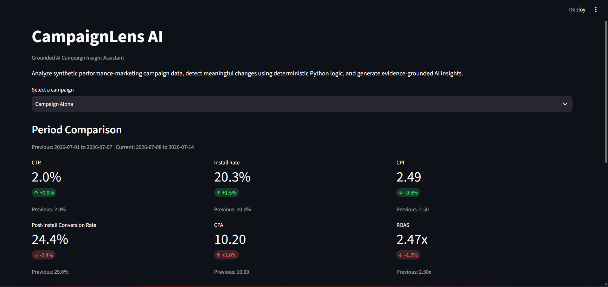
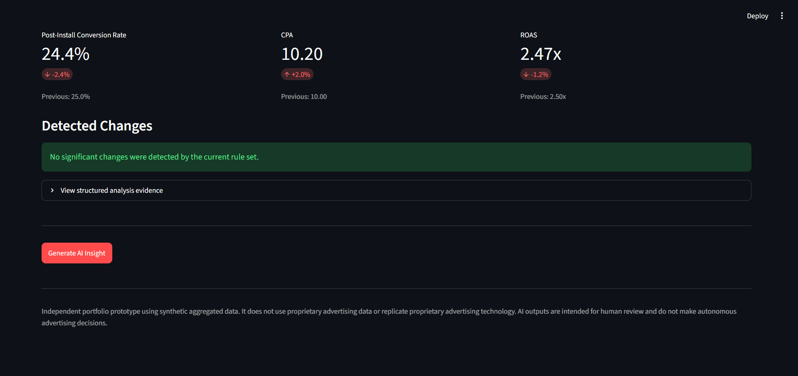
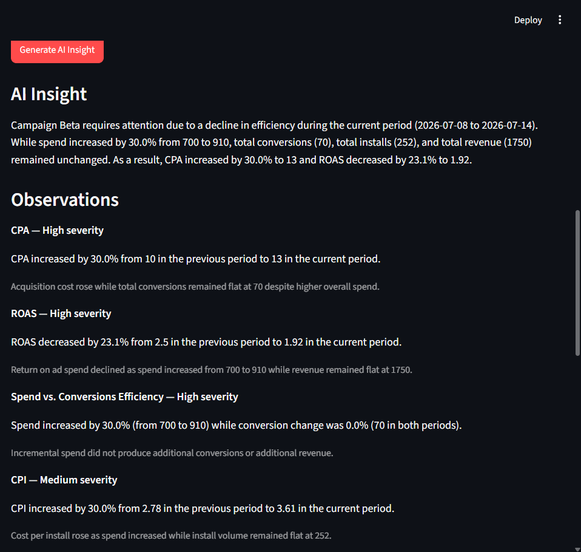

# CampaignLens AI

**Grounded AI Campaign Insight Assistant**

CampaignLens AI is a small AI product prototype that analyzes synthetic performance-marketing campaign data, detects meaningful performance changes using deterministic Python logic, and uses an LLM to turn those signals into structured, evidence-grounded insights.

The core design principle is simple:

> **Python is the source of truth for numbers. The LLM is used for interpretation and communication.**

---

## Demo

CampaignLens compares two campaign periods, calculates performance metrics using deterministic Python logic, detects meaningful changes, and provides structured evidence for grounded AI analysis.

### Campaign Performance Overview



### Deterministic Change Detection



### Generated AI Insight



---

## Why This Project?

Performance-marketing data can contain many metrics across multiple campaigns and time periods.

A human analyst may need to review spend, impressions, clicks, installs, conversions, revenue, CPA, ROAS, and other metrics to understand what changed and what deserves attention.

CampaignLens AI explores a focused product hypothesis:

**Can deterministic analytics identify the important signals while an LLM helps explain those signals clearly without becoming responsible for the numerical calculations?**

The project was designed as a small applied-AI product experiment rather than a large analytics platform.

---

## Core Product Flow

```text
Synthetic Campaign CSV
        ↓
Data Validation
        ↓
7-Day Period Aggregation
        ↓
Deterministic Metric Calculation
        ↓
Performance Change Detection
        ↓
Structured Evidence
        ↓
Gemini API
        ↓
Structured LLM Output
        ↓
Pydantic Validation
        ↓
Streamlit Interface
```

---

## Key Design Decision

CampaignLens AI deliberately separates deterministic computation from generative AI.

### Python handles

- CSV validation
- period aggregation
- campaign metric calculation
- percentage-change calculation
- rule-based performance change detection

### The LLM handles

- summarizing supplied evidence
- explaining important changes
- separating observations from hypotheses
- suggesting investigation steps
- communicating uncertainty and limitations

The LLM does **not** calculate CPA, CPI, CTR, ROAS, or other campaign metrics.

This reduces the opportunity for numerical hallucination and keeps the analytical pipeline explainable.

---

## Metrics

CampaignLens AI currently calculates:

| Metric | Formula |
| --- | --- |
| CTR | Clicks / Impressions |
| Install Rate | Installs / Clicks |
| CPI | Spend / Installs |
| Post-Install Conversion Rate | Conversions / Installs |
| CPA | Spend / Conversions |
| ROAS | Revenue / Spend |

Division-by-zero cases are handled safely rather than returning misleading numerical values.

---

## Performance Change Detection

The MVP uses transparent rule-based thresholds instead of machine-learning anomaly detection.

Examples include:

- significant CPA increase
- significant ROAS decrease
- significant Install Rate decrease
- significant Post-Install Conversion Rate decrease
- spend increasing significantly while conversions remain approximately flat

These thresholds are prototype assumptions rather than industry standards.

In a production environment, they would need to be calibrated using historical data and business context.

---

## Synthetic Evaluation Scenarios

The sample dataset contains three campaigns designed to represent understandable scenarios.

### Campaign Alpha — Stable Performance

Performance remains relatively stable between the two periods.

Expected behavior:

- deterministic status: `stable`
- no significant issue should be created
- the LLM should avoid manufacturing problems

### Campaign Beta — Spend Efficiency Deterioration

Spend increases significantly while installs, conversions, and revenue remain flat.

Expected signals include:

- higher CPA
- lower ROAS
- spend-efficiency problem

### Campaign Gamma — Install Rate Deterioration

Clicks remain relatively healthy while installs decline significantly.

Expected signal:

- lower Install Rate

These predefined scenarios provide a simple ground truth for evaluation.

---

## Structured AI Output

Gemini responses are constrained to a structured schema using Pydantic.

The output includes:

```json
{
  "executive_summary": "...",
  "observations": [
    {
      "metric": "CPA",
      "severity": "high",
      "evidence": "...",
      "interpretation": "..."
    }
  ],
  "possible_hypotheses": [
    "..."
  ],
  "recommended_checks": [
    "..."
  ],
  "confidence": "high",
  "limitations": [
    "..."
  ]
}
```

Observations are intended to be directly supported by supplied campaign evidence.

Hypotheses are possible explanations that require additional evidence.

---

## Prompt Engineering Experiment

CampaignLens AI includes two prompt versions.

### Prompt V1

The first prompt instructed the model to use supplied evidence and return structured campaign insights.

Testing revealed two reliability weaknesses:

- the model sometimes assumed a currency that was not provided
- it could generate observations and hypotheses for a campaign classified as stable

### Prompt V2

Prompt V2 introduced stronger grounding rules:

- never assume an unspecified currency
- require numerical evidence for observations
- separate observations from hypotheses
- avoid unsupported causal claims
- acknowledge missing information
- do not manufacture issues when deterministic detection reports a stable campaign

The same model, data, output schema, and evaluation scenarios were used when comparing both prompts so that the prompt itself remained the primary variable being changed.

---

## Evaluation

The project includes a lightweight evaluation workflow using three predefined scenarios.

The automated checks currently evaluate:

1. valid structured output
2. alignment with the expected issue
3. absence of invented currency
4. correct handling of stable campaigns

### Observed Results

| Scenario | Prompt V1 | Prompt V2 |
| --- | ---: | ---: |
| Stable campaign | 2/4 | 4/4 |
| Spend-efficiency issue | 3/4 | 4/4 |
| Install-rate issue | 3/4 | 4/4 |

These results are based on a small prototype evaluation and should not be interpreted as a production benchmark.

Qualitative properties such as recommendation usefulness, unsupported causality, and appropriate confidence still require human review.

---

## Streamlit Interface

The Streamlit application allows a user to:

1. select a synthetic campaign
2. compare the previous and current seven-day periods
3. view deterministic campaign metrics
4. view detected performance changes
5. inspect the structured analysis evidence
6. generate a structured AI insight
7. review observations, hypotheses, recommended checks, confidence, and limitations

The AI request is only sent when the user explicitly clicks **Generate AI Insight**.

---

## Project Structure

```text
campaignlens-ai/
│
├── app.py
├── README.md
├── PRODUCT_BRIEF.md
├── requirements.txt
├── .env.example
├── .gitignore
│
├── data/
│   └── sample_campaign_data.csv
│
├── src/
│   ├── data_loader.py
│   ├── metrics.py
│   ├── period_analysis.py
│   ├── change_detector.py
│   ├── prompts.py
│   └── llm_client.py
│
├── evaluation/
│   ├── eval_cases.py
│   └── evaluate.py
│
└── tests/
    ├── test_metrics.py
    ├── test_data_and_detection.py
    └── fixtures/
        ├── empty.csv
        └── invalid_missing_revenue.csv
```

---

## Tech Stack

- Python
- pandas
- Gemini API
- Google GenAI SDK
- Pydantic
- Streamlit
- pytest
- python-dotenv
- Git / GitHub

---

## Running the Project

### 1. Clone the repository

```bash
git clone <repository-url>
cd campaignlens-ai
```

### 2. Create a virtual environment

On Windows:

```powershell
python -m venv .venv
```

Activate it:

```powershell
.\.venv\Scripts\Activate.ps1
```

### 3. Install dependencies

```powershell
python -m pip install -r requirements.txt
```

### 4. Configure the Gemini API key

Create a `.env` file in the project root:

```env
GEMINI_API_KEY=your_api_key_here
```

The `.env` file is excluded from Git and should never be committed.

### 5. Run the Streamlit application

```powershell
python -m streamlit run app.py
```

Then open the local Streamlit URL shown in the terminal.

---

## Running the Tests

```powershell
python -m pytest -q
```

Current deterministic backend test suite:

```text
7 passed
```

The tests cover:

- campaign metric calculation
- division-by-zero handling
- percentage-change edge cases
- stable campaign detection
- expected issue detection
- missing required CSV columns
- empty CSV handling

---

## Running the Prompt Evaluation

```powershell
python -m evaluation.evaluate
```

This runs Prompt V1 and Prompt V2 against the predefined synthetic scenarios.

Because the evaluation uses a live hosted LLM API, individual generated text may vary between runs.

---

## Responsible AI

CampaignLens AI is intentionally designed as a human-in-the-loop decision-support prototype.

The project uses:

- synthetic campaign data only
- aggregated data
- no personal data
- no user-level targeting data
- no autonomous campaign changes

The system explicitly separates:

**Observation**  
A statement supported by supplied data.

**Hypothesis**  
A possible explanation that requires additional evidence.

AI-generated recommendations are investigation suggestions for a human reviewer, not autonomous marketing decisions.

---

## Limitations

Current limitations include:

- synthetic rather than real campaign data
- fixed seven-day comparison periods
- simple heuristic detection thresholds
- limited evaluation scenarios
- one hosted LLM provider
- no historical threshold calibration
- no live advertising integrations
- no production-grade anomaly detection

---

## Future Improvements

Possible future extensions include:

- CSV upload
- configurable comparison periods
- threshold calibration using historical data
- additional evaluation scenarios
- human evaluation rubrics
- model latency and cost measurement
- campaign comparison charts
- support for additional model providers

These are intentionally outside the current MVP.

---

## Disclaimer

CampaignLens AI is an independent portfolio prototype built using synthetic aggregated campaign data.

It does not use proprietary advertising data, represent any real advertising platform, or replicate proprietary advertising technology.

Its outputs are intended for experimentation and human-reviewed decision support rather than autonomous campaign optimization.